# PRの仕方

言語ごとの使い方のPRの仕方について解説します。

サマリーを書いておきます。

1. 手元の環境で`rlr`を触ってみて、解きたい言語でのコマンド例を見つける(考える)。
2. リポジトリをフォークし、作業環境を整える。
3. 1で考えた内容をドキュメントとして作成する。
4. PRを作成し、PRを投げる。
5. あとはレビュー、承認されるのを待つ。

## 好きな言語で問題を解いてみる

まず、好きな言語で問題を解いてみましょう。

その後、`rlr`をつかってジャッジするわけですが、その際に`rlr`にわたすコマンドを考える必要があります。

スクリプト言語(`Python`や`Ruby`)などはREPLに渡せば実行ができるので、比較的簡単なコマンドで良いと思います。

例として`Python`では以下のようになります。

```sh
rlr judge "python main.py"
```

コンパイルが必要な言語の場合はちょっと複雑になります。

先にコンパイルを行って実行ファイルを作成し、その後、作成した実行ファイルを起動するコマンドを書く必要があります。

そのため、シェルスクリプトかバッチファイルを作成し、毎回そのスクリプトかバッチを用いてジャッジを走らせるようにすると良いでしょう(これはスクリプト言語でも同様に取り入れても良いかと思います)。

例として`C言語(gcc)`の例を示します。

```sh
#!/bin/bash

# コンパイルを実行
gcc main.c -o main

# 実行権限を付与
chmod +x main

# rlrでジャッジを実行
rlr j "./main"

# オプション：不要になった実行ファイルを削除する
rm ./main
```

> **NOTE:** 言語によっては中間ファイルも作成する言語がありますので、その場合は中間ファイルを削除するコマンドを追加すると良いかもしれません。

## PR作業

解き方の環境を構築できたら、あとはPRを出す作業です。

### リポジトリのフォークして作業をする

#### リポジトリのフォーク

まずは手元の環境にリポジトリをフォークしましょう。

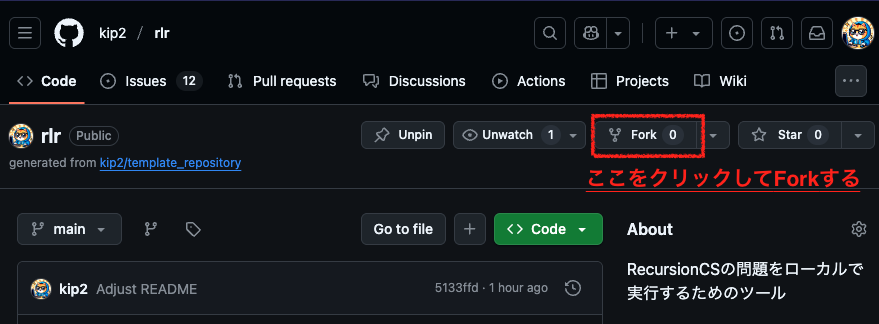

#### フォークしたリポジトリをクローン

その後は、フォークしたリポジトリをクローンして下さい。

まず、フォークしたリポジトリから、画像の順番でURLをコピーします(画像はHTTPSの例)。

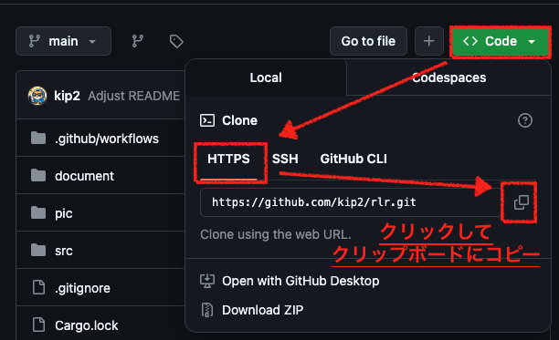

その後、手元のシェルから以下のコマンドを実行し、クローンします。

```sh
git clone <コピーしたURL>
```

#### ブランチを作成

作業に取り掛かる準備の最後の作業として、作業用のブランチを作成しましょう。

ブランチ作成には以下の手順が必要です。

- 関連するissueを見つける(あるいは作成する)。
- 関連するissueに紐づけたブランチを作成する。

以下、個別に説明します。

##### issueを見つける

まず、関連するissueを見つけましょう。

> **NOTE:** もしなければ先にissueを投げて下さい。やりかたは別途説明します。

`Issues`ページにアクセスしましょう。

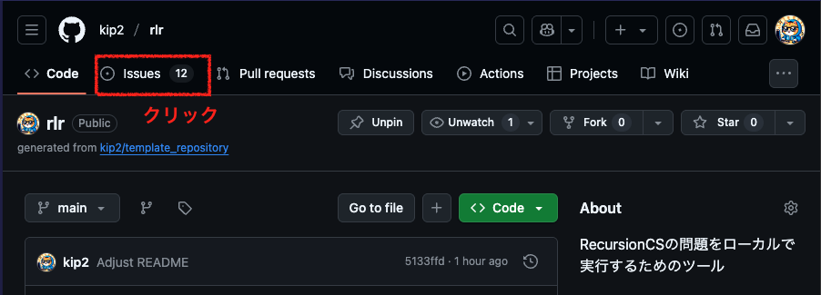

issueの番号を確認しましょう。

今回はC言語の使い方例を追加すると仮定して、「C言語での使い方テンプレートが無い」を参照します。

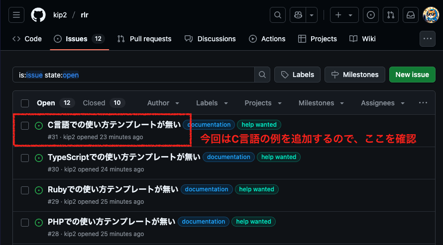

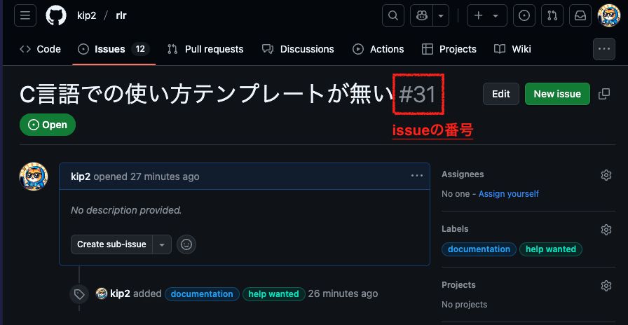

`#31`がissueの番号であることが確認できました。

この番号を含めて、以下の形式でブランチ名を作成し、その名前を元にブランチを作成して下さい。

ブランチ名: `fix-issue-<issueの番号>`

ブランチ作成コマンド
```sh
git checkout -b fix-issue-#31

# あるいは
git checkout -b fix-issue-31
```

これで作成したブランチへチェックアウトも行われているので、そのまま作業を行って下さい。

##### append: issueを作成する

自分の出したい言語でのissueが無い場合は、ブランチを切る前にissueを作成して下さい。

例えば`Common Lisp`の使い方を追加したいのに、issueに無いとしましょう。

まずは`Issues`ページから`New issue`をクリックして下さい。

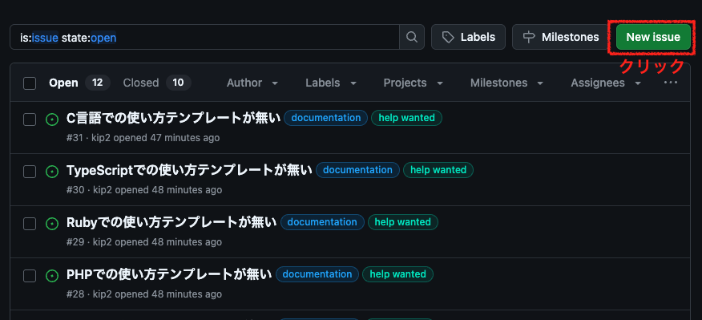

タイトル、内容を記入したら、`Create`をクリックして下さい。

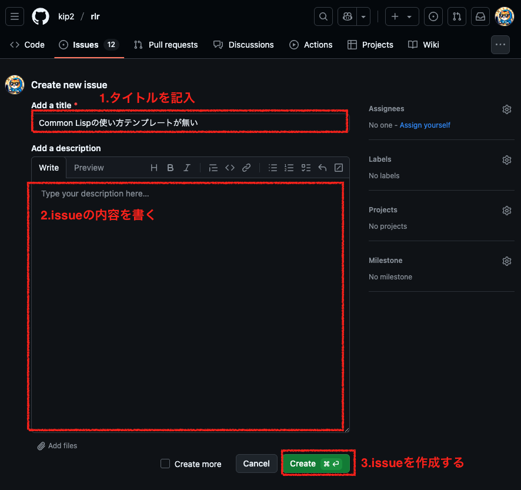

issueが作成されますので、issue番号をメモして下さい。

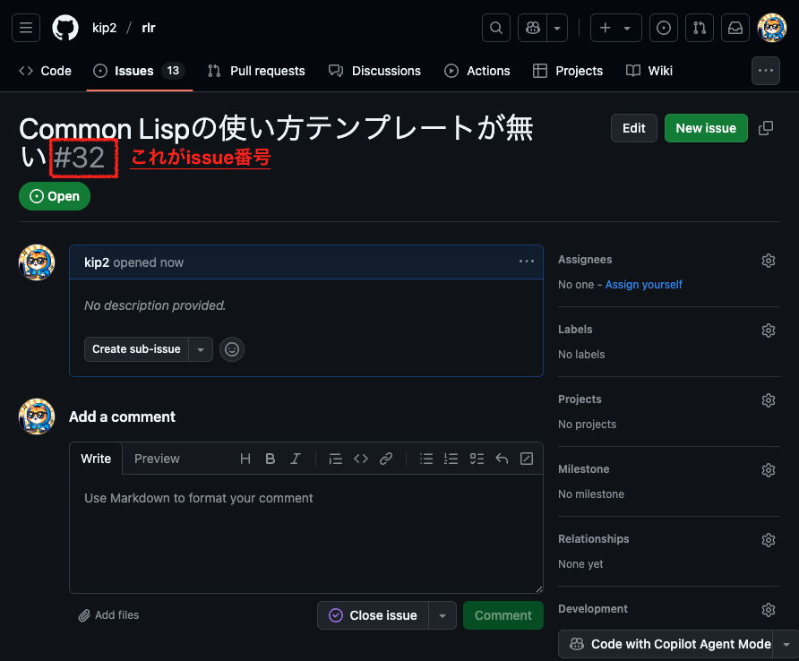

この番号を含めて、以下の形式でブランチ名を作成し、その名前を元にブランチを作成して下さい。

ブランチ名: `fix-issue-<issueの番号>`

ブランチ作成コマンド
```sh
git checkout -b fix-issue-#31

# あるいは
git checkout -b fix-issue-31
```

これで作成したブランチへチェックアウトも行われているので、そのまま作業を行って下さい。

### PRを出す

さて、作業を終えたらPRを出しましょう。

PRにあたって必要な作業は以下になります。

1. 変更内容をコミットする。
2. ブランチをプッシュする。
3. Github上でPRを作成する。

#### 変更内容をコミットする

まずは変更内容をコミットしましょう。

```sh
# 編集したファイルすべてをステージングする必要があると仮定します。
# 個別にファイルをステージングする必要がある場合は、addの後にファイル名を指定して下さい。
git add .

# コミット(メッセージは例)
git commit -m "Fix #31: C言語での使用例を追加"
```

> **NOTE:** コミットメッセージは`Fix #<issue番号>:`の形式で始めてもらえれば、メッセージ内容は何でも良いです。日本語でも英語でも構いません。

#### コミットした内容をプッシュする

コミットした内容を自分のリポジトリにプッシュしましょう。

```sh
git push origin fix-issue-#31
```

#### Github上でPRを作成する

`rlr`のGithubのページに移動して下さい。

> **NOTE:** フォークした方のリポジトリではなく、フォーク元の`rlr`のリポジトリであることに注意して下さい。

画像の箇所をクリックしてPR作成画面に移動して下さい。

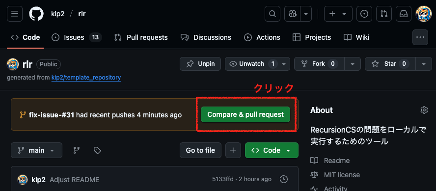

PRの内容を記載して、`Create pull request`をクリック。

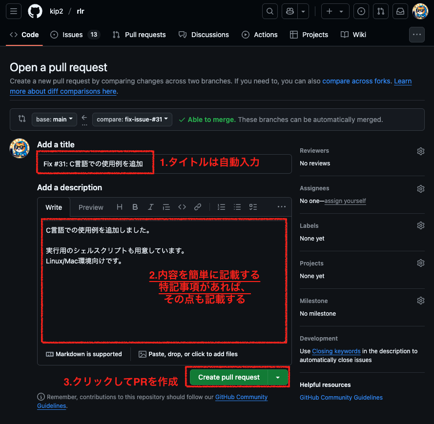

お疲れ様です！

これでPRが作成されました！

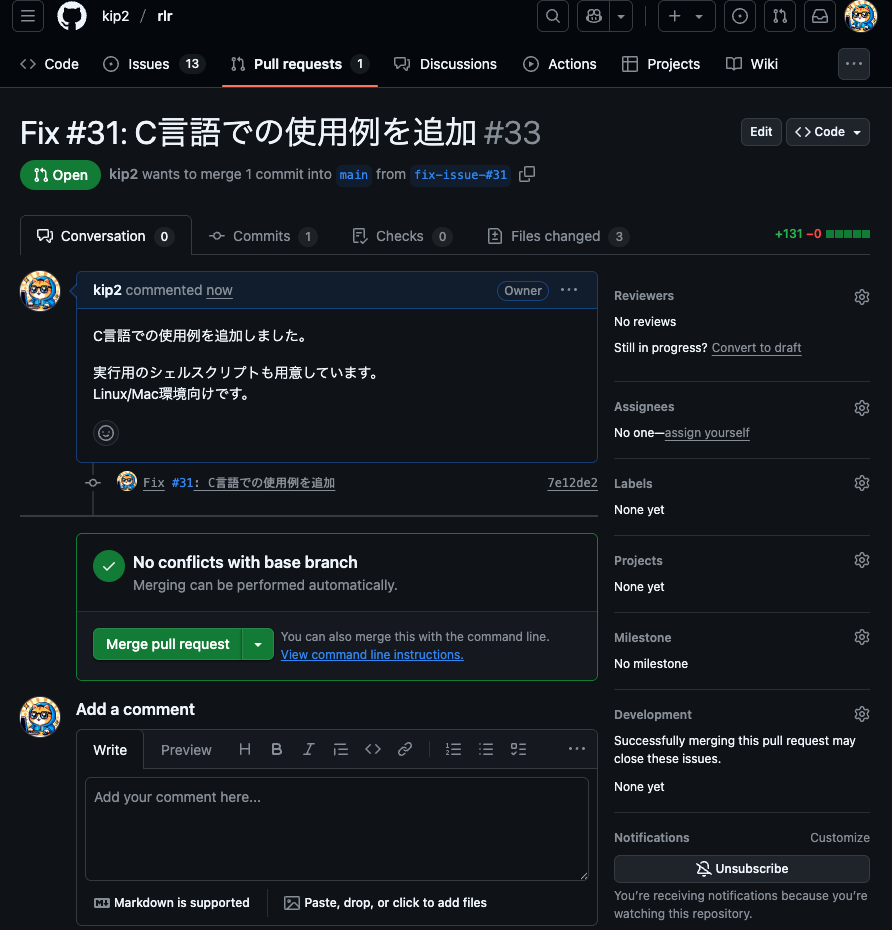

#### レビューを待つ

あとはレビューが行われるのを待ちましょう。

内容が問題なければマージされます。

なにか内容で気になる点があった場合は、事前に質問等があるかもしれません。

その場合はお手数ですが、質問への回答にご協力下さい。

---

## template

使い方を書く際のtemplateを用意しました。

[template](./template.md)

かならずこのテンプレートに従って書かなければいけない、ということではないですが、使い方例の書き方に悩む場合に参考にして下さい。

## 参考記事

以下の記事が参考になるかと思います。

[Github で Fork して PullRequest を送るのはこんなに簡単](https://qiita.com/YumaInaura/items/acff806290c8953d3185)

[Forkを使って開発したときのpull requestの出し方・注意点](https://qiita.com/morieeeenyo/items/9a83ebb6655dd792d05a)
